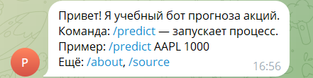
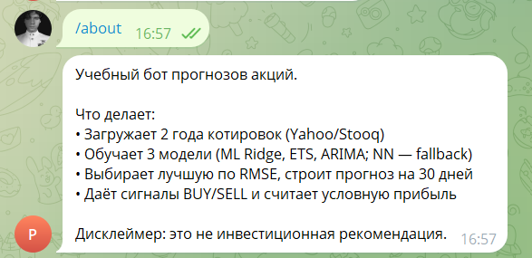
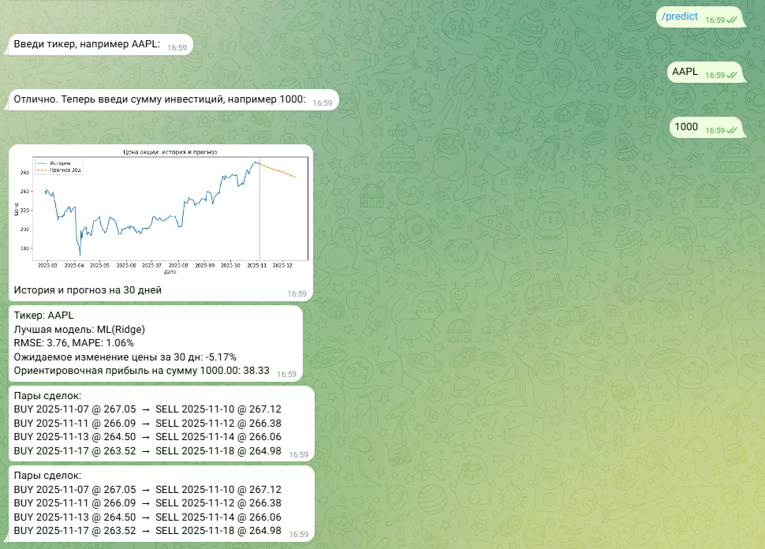
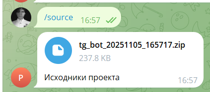
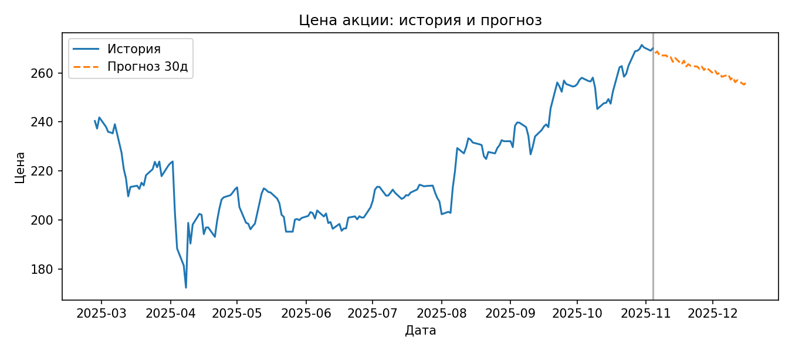

# Telegram-бот прогнозов акций (Time Series)

Бот загружает котировки за 2 года, обучает 3 модели (ML Ridge, ETS, ARIMA; NN — fallback), выбирает лучшую по RMSE, строит прогноз на 30 дней, даёт сигналы BUY/SELL и считает условную прибыль.

> Дисклеймер: проект предназначен только для учебных целей и **не** является инвестиционной рекомендацией.

---

## Быстрый старт

Требования: установлен **Python 3.10+** и доступ в интернет.

### 1) Клонировать репозиторий
```bash
git clone https://github.com/pero1x1/peroalxbot.git
cd peroalxbot
````

### 2) Создать виртуальное окружение и установить зависимости

**Windows (PowerShell):**

```powershell
py -3.10 -m venv .venv
.\.venv\Scripts\Activate.ps1
pip install -U pip
pip install -r requirements.txt
```

**macOS / Linux:**

```bash
python3 -m venv .venv
source .venv/bin/activate
pip install -U pip
pip install -r requirements.txt
```

### 3) Настроить токен бота

Скопируйте пример и вставьте токен от BotFather.

```bash
# Windows
copy .env.example .env && notepad .env
# macOS / Linux
cp .env.example .env && nano .env
```

Переменные:

```
BOT_TOKEN=ВАШ_ТОКЕН_ОТ_BOTFATHER
DATA_SOURCE=auto   # auto|stooq|yahoo (auto включает резервный источник)
```

### 4) Запуск бота

```bash
python -m bot.main
```

В Telegram отправьте боту: `/start`, `/about`, `/predict AAPL 1000`.

**Подсказка (Windows, в две строки):**

```powershell
py -3.10 -m venv .venv; .\.venv\Scripts\Activate.ps1; pip install -r requirements.txt
copy .env.example .env; notepad .env; python -m bot.main
```

---

## Команды

* `/start` — краткая справка
* `/help` — как вводить параметры
* `/predict TICKER AMOUNT` — быстрый режим, пример: `/predict AAPL 1000`
* `/predict` — диалог: тикер → сумма
* `/about` — описание и дисклеймер
* `/source` — прислать zip с исходниками проекта

---

## Как это работает

* **Данные:** `yfinance` с ретраями + fallback на Stooq (`pandas-datareader`). Индекс делаем tz-naive, ресемпл до B-дней с `ffill()`/`bfill()`.
* **Сплит:** последние 60 дней — тест (адаптация при малом количестве данных).
* **Фичи (ML):** лаги `L1..L30`, скользящие mean/std окна 7 и 14; `RidgeCV`. Прогноз на 30 дней — рекурсивно.
* **Статистика:** ETS (`ExponentialSmoothing`) и SARIMAX с маленькой сеткой `(p,d,q) ∈ {0..2}×{0,1}×{0..2}`.
* **Нейросеть:** LSTM при наличии TensorFlow, иначе fallback на `MLPRegressor`.
* **Метрики:** RMSE — основной критерий; дополнительно показывается MAPE.
* **Визуализация:** ~180 дней истории + 30 дней прогноза пунктиром, вертикальная линия «сегодня». PNG уходит в чат и сохраняется в `examples/`.
* **Сигналы:** локальные минимумы → BUY, следующие максимумы → SELL; считаются последовательные пары и условная прибыль.
* **Логи:** `logs.csv` — одна строка на запрос:
  `user_id,timestamp,ticker,amount,best_model,rmse,mape,horizon,est_profit,status,error_msg`.

---

## Структура проекта

```
project/
├─ bot/                 # Telegram-логика (handlers, main, utils)
├─ core/                # загрузка данных, фичи, выбор модели
├─ models/              # ML/ETS/ARIMA/NN
├─ viz/                 # графики и сигналы
├─ examples/            # сохраняемые PNG прогнозов
├─ scr/                 # скриншоты для README/отчёта
├─ logs.csv             # логи сессий
├─ .env.example         # пример env
├─ requirements.txt
└─ README.md
```

## Скриншоты

| /start                  | /about                  |
| ----------------------- | ----------------------- |
|  |  |

| /predict (диалог)           | /source                   |
| --------------------------- | ------------------------- |
|  |  |

Примеры графиков сохраняются в `examples/`, например:



---

## Требования

* Python 3.10+
* Windows, macOS или Linux
* Интернет-доступ (для загрузки котировок с Yahoo/Stooq)
